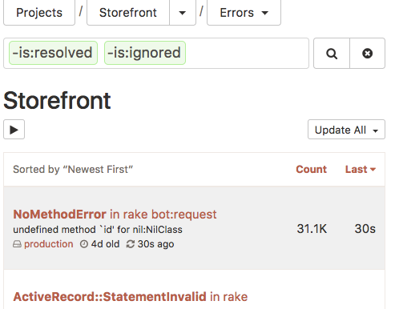
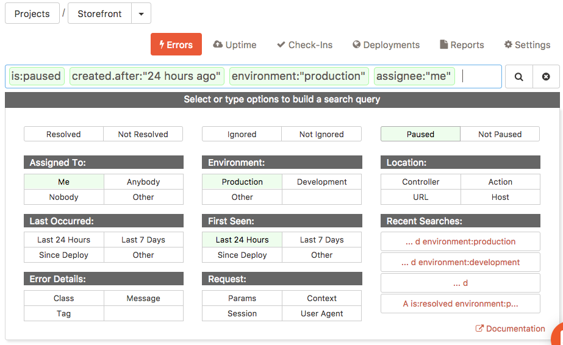
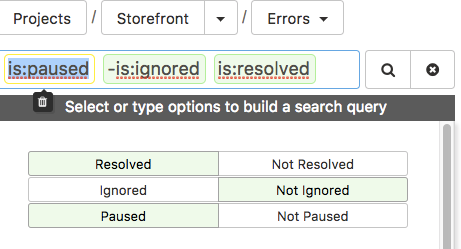
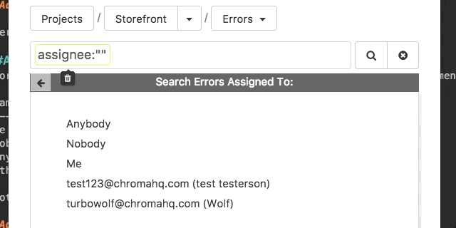
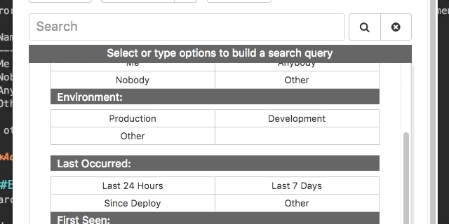
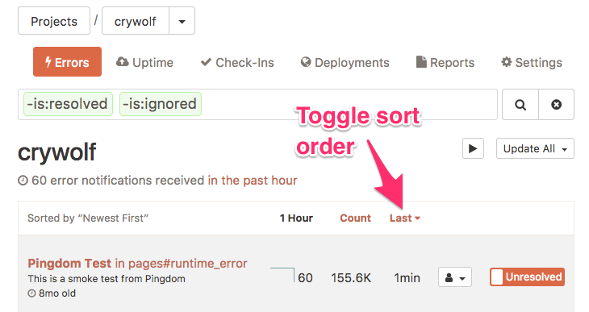
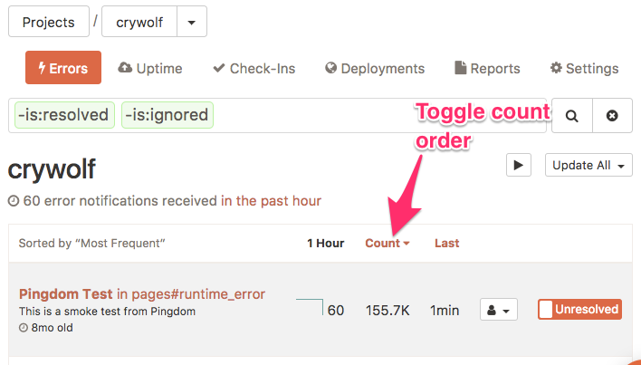
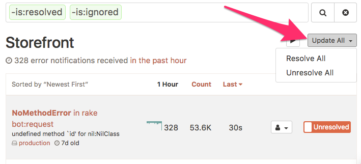

# Honeybadger Search Documentation
Honeybadger's search lets your team powerfully search errors to resolve quickly. You can search errors in one project or across all projects. 

Searches can be done through the search box or keyboard shortcuts when the search box is unselected. `Key:value` tokens may be combined to refine results, and may also be combined with a full-text query. 

`Key:value` tokens can appear in the search box in any order. 

## How combined tokens filter results
Positive tokens use OR to match results. An example of a match is a  search for `class:Foo class:Bar `; the search results will include errors with class `Foo` OR `Bar`.

Negative tokens (which begin with a minus sign: `-`) always use AND, so that `"-class:Foo -class:Bar"` will return results which are not class `Foo` AND not class `Bar`.

## Keyboard shortcuts

Search errors by these keyboard shortcuts outside of the search box: 

| Key      | Response  |
| ------------- |:-------------:| 
| / | Focus search box | 
| A or a | Show resolved And Unresolved Errors| 
| U or u | Show Unresolved Errors|
| R or r | Show Resolved Errors| 
| M or m	| Show Errors Assigned to Me|
| T or t|	Show All Users' Errors|
| J or j | Jump to another project | 
| E or e | Show errors in all environments *| 

**Use first character of environment name to filter by environment.*

## Search box

Enter `key:value` tokens into the search box to refine results. Multiple tokens may be combined, and may also be combined with an optional full-text query.

Example query:
`john class:UserError -tag:wip -tag:pending component:UsersController action:update`.

Tokens are separated by spaces and are denoted by green highlighting. Text will be denoted with yellow highlighting if the query does not match `key:value` token format, like full text. 

The search box is populated by default with `-is:resolved -is:ignored`, which will show all errors that are not resolved or ignored. 

### Text search

Search through your errors by **class** or error **message** by going to your project page and typing your search term into the search box. Text queries can also be combined with key:value tokens: 
`john class:UserError -tag:wip -tag:pending component:UsersController action:update`.

### Search box keyboard shortcuts
 
 Key      | Response  |
| ------------- |:-------------:| 
| enter | submits form |
| tab | tabs to next token and selects value inside quotes | 
| shift-tab | reverse-cycles selected token| 
| tab to beginning of line | adds placeholder ("...")| 
| tab out of placeholder | removes placeholder|
| mod backspace | deletes selected token| 
| escape | closes hint| 
| typing | triggers autocomplete |

### Search palette 

Use the search palette to refine your query. Query tokens are separated by spaces and are denoted by green highlighting, or yellow highlighting if the query is not a key:value token. 

### Resolved, ignored, paused

Search errors that are resolved, ignored, paused, or unresolved, not ignored, or unpaused. 

| Name       | Matches errors   | Example  |
| ------------- |:-------------:| -----:|
| Resolved | Resolved | `is:resolved`| 
| Not resolved | Unresolved | `-is:resolved` |
| Paused | Paused| `is:paused` |
| Not paused | Unpaused  |`-is:paused` |
| Ignored| Ignored  |`is:ignored` |
| Not ignored | Not ignored  |`-is:ignored` |

Example: 
.

Generates errors that are paused, unresolved, and ignored. 

### Assigned to

Errors can be assigned to team members, and results can be refined by assignment. Tokens can be combined to search errors assigned to multiple team members. 

| Name       | Matches errors   | Example  |
| ------------- |:-------------:| -----:|
| Me | Assigned to you | `assignee:"me"`| 
| Not me| Not assigned to me| `-assignee:"me"`|
| Nobody | Unassigned | `assignee:"nobody"` |
| Anybody | Assigned to anyone| `assignee:"anybody"` |
| Other | Assigned to one team member |`assignee:""` |
| Not other| Not assigned to one team member| `-assignee:""`|

If other, choose a team member from the dropdown list or begin typing to trigger autocomplete.

.

### Environment

Search errors by your development environment:

| Name       | Matches errors   | Example  |
| ------------- |:-------------:| -----:|
| Production | In production | `environment:"production"`| 
| Not production | Not in production | `-environment:"production"`|
| Development| In development | `environment:"development"` |
| Except development| Not in development | `-environment:"development"` |
| Other | In another environment | `environment:"test"` |

If other, choose an environment from the dropdown list or begin typing to trigger autocomplete.

.

### Last Occurred

Search errors by their last occurrance. Last Occurred can also be combined with First Seen to create a date range. User's timezone is automatically determined but can be changed manually. 

| Name       | Matches errors   | Example  |
| ------------- |:-------------:| -----:|
| Last 24 Hours | From the last 24 hours | `occurred.after:"24 hours ago"`|
| Last 7 Days| From the last 7 days | `occurred.after:"7 days ago"` |
| Since Deploy* | Since last deploy | `occurred.after:"YYYY-MM-DD 19:19 UTC"` |
| Other | Custom date | `occurred.after:"YYYY-MM-DD 0:00 UTC-7"` |

*Since Deploy will not appear if deploy has not occurred.

You can also enter human-friendly dates like `today`, `this week`, or `July 1`, for example: `occurred.after:"this week"`. 

### First Seen

Search errors by when they were first seen. First Seen can also be combined with Last Occurred to create a date range. User's timezone is automatically determined but can be changed manually. 

| Name       | Matches errors   | Example  |
| ------------- |:-------------:| -----:|
| Last 24 Hours | First seen in the last 24 hours | `created.after:"24 hours ago"`| 
| Last 7 Days| First seen in the last week | `created.after:"7 days ago"` |
| Since Deploy* | First seen since last deploy | `created.after:"YYYY-MM-DD 19:19 UTC"` |
| Other | Custom date | `created.after:"YYYY-MM-DD 0:00 UTC-7"` |

*Since Deploy will not appear if deploy has not occurred.

You can also enter human-friendly dates like `today`, `this week`, or `July 1`, for example: `created.after:"September 12"`.

### Error details
Search error details by class, tag, and message. 

 Name       | Matches errors   | Example  |
| ------------- |:-------------:| -----:|
| class | With a certain class | `class:"PermissionDeniedError"`| 
| -class| Without a certain class | `-:"PermissionDeniedError"`|
| tag| With a certain tag name | `tag:"tag_example"` |
| -tag| Without a certain tag name | `-tag:"tag_example"` |
| message | With a message | `message:"404"` |
| -message | Without message text | `-message:"404"` |

Class, tag, and message can be combined for specific results. For example, the query: `message:"NameError" class:"TextOrganizer" tag:"priority"` searches errors containing "NameError" from the TextOrganizer class with a "priority" tag. 

### Location
Search errors by component, action, URL, and host.  

 Name       | Matches errors   | Example  |
| ------------- |:-------------:| -----:|
| control | With a controller/component | `component:"UsersController"`| 
| -control | Without a controller/component | `-component:"UsersController"`| 
| action| With an action | `action:"update"`  |
| -action| Without an action | `-action:"update"`  |
| url | That happened at the specified URL| `request.url:"camera"` |
| -url | That happened without specified URL| `-request.url:"camera"` |
| host | On a server with this name | `request.host:"Example"` |
| -host | Not on a server with this name | `request.host:"Example"` |

Locations can be combined for more specific results. For example, the query: `component:"UsersController" action:"update" request.url:"/docs"` searches errors generated from the update action in the UsersController in the /docs.

### Request
Search for all errors with a matching value for a particular key in the context, params, user agent, or session hashes. 

 Name       | Matches errors   | Example  |
| ------------- |:-------------:| -----:|
| Context | in { user: { email: "bob@example.com" }  | `context.user.email:"bob@example.io"`| 
| -Context| Not coming from the `user.name` context "Bob" | `-context.user.name:"Bob"`|
| Params | Coming from "Bob" in the `params.user.first_name` params | `params.user.first_name:"Bob"`|
|-Params | Not coming from the `params.old:"useless"` params | `params.old:"useless"`|

Requests can be combined or nested for more specific results. 

For example, searching for context.user.email:bob@example.com would match the following hash that was sent in the context with an error:

`{ user: { email: "bob@example.com" } } `

When searching these hashes, separate the nested levels of the hash with a period. For example `params.user.first_name:bob`.

Searches against context, param, user agent, or session hashes use * as a wildcard, so a search for `context.user.email:*@example.com` would match any email address at example.com.

## Negative searches

Searches for context, params, session, request, and occurred fields can be negated by prepending a "-" to the field name. For example, if you wanted to exclude any errors that were triggered by Googlebot, you could do a negative search like this:

`-request.user_agent:*Googlebot*`

## Sorting results
Error results  can be sorted by date or error count.

### Sort by date
Sorting by "Last seen" lets you quickly jump to the newest or oldest exceptions that match your search result.

1. Go to your project's error list page
2. Click on the table header labeled "last seen"
3. Click on it again to reverse the sort order 

 

### Sort by count
Sorting by "Times" lets you see which errors have happened the most or the fewest times.

1. Go to your project's error index
2. Click on the table header labeled "times"
3. Click on it again to reverse the sort order

## Update all
Errors can be grouped and batch resolved or unresolved. 

1. Use the search to select which errors you'd like to bulk resolve.
2. Click on "Update All" and choose an option from the dropdown.

